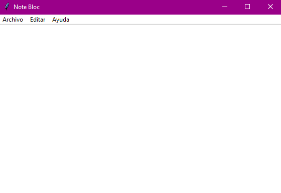
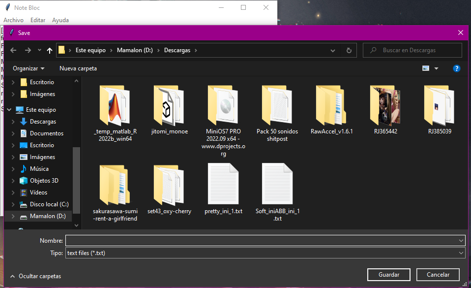

# Note Bloc
## Este es un programa capaz de abrir, editar y crear archivos de texto y guardarlos en varias de sus formas como: (.txt, .py, .cpp, etc)
* Aqui podemos ver como se ve el programa:

  
* Ahi podemos tambien observar que tiene una barra de menu a la cual podemos acceder facilemtne.
  * En este tambien se puede escribir y crear asi un nuevo archivo.
  
* En el apartado de archivo podemos abrir, guardar y cerrar los archivos que utilicemos.

* Abrimos un archivo.

* Archivo abierto*

* ahora lo podemos guardar con cualquier nombre o tipo de texto.

----
## El apartado de Editar aun no esta completo.
----
* Asi tambien en el apartado de ayuda podemos ver bastante informacion que nos puede ayudar en caso de querer saber como funciona el programa:
___


* asi tambien como el manual de usuario que veras proximamente en este repositorio en github :D.


----
#### El siguiente codigo es lo que se ocupo en la aplicacion:
```py
from tkinter import *
from tkinter import ttk
from tkinter.filedialog import askopenfile, asksaveasfilename, SaveFileDialog 
import webbrowser 
import os 

title = "Editor / python - tkinter"
win = Tk()
url_file = "" 
win.title(title)
win.title("Note Bloc")
text = Text(win)

def open_file():
    blank.delete("1.0", END)
    file = askopenfile(mode='r', filetypes=[('text files', '*.txt'),('Python', '*.py'),('C++', '*.cpp'),('C#', '*.cs'),('todos los archivos', '*.*')])
    if file is not None:
        text = file.read()
        blank.insert("1.0", text)

def save_file():
    notepad_text = blank.get("1.0", END)
    file = asksaveasfilename(title="Save", filetypes=[('text files', '*.txt'),('Python', '*.py'),('C++', '*.cpp'),('C#', '*.cs'),('todos los archivos', '*.*')])
    with open(file, "w") as data:
        data.write(notepad_text)
        
        
def Informacion():
 webbrowser.open('https://www.canva.com/design/DAFQ7qp4u8w/cceTNLs9YV0W2ZkNou1Z2g/view?utm_content=DAFQ7qp4u8w&utm_campaign=designshare&utm_medium=link&utm_source=publishsharelink')
    
def manual_file(): 
    webbrowser.open('https://github.com/LeYounTempest/Note-bloc')
        
def integrante():
    webbrowser.open('https://www.canva.com/design/DAFQ7qDSPI0/3yFpKODQPCO24w9T-BU3CA/view?utm_content=DAFQ7qDSPI0&utm_campaign=designshare&utm_medium=link&utm_source=publishsharelink')
    
    
global textArea
textArea = Text(win)
menubar = Menu(win)
win.config(menu=menubar)

filemenu = Menu(menubar, tearoff=0)
menubar.add_cascade(label="Archivo", menu=filemenu)
filemenu.add_command(label="Abrir", command=open_file)
filemenu.add_command(label="Guardar", command=save_file)
filemenu.add_command(label="Exit", command=win.destroy)

filemenu = Menu(menubar, tearoff=0)
menubar.add_cascade(label="Editar", menu=filemenu)

filemenu = Menu(menubar, tearoff=0)
menubar.add_cascade(label="Ayuda", menu=filemenu)
filemenu.add_command(label="Información", command=Informacion)
filemenu.add_command(label="Manual de usuario", command=manual_file)
filemenu.add_command(label="Integrante", command=integrante)

blank = Text(win, font=("arial", 10))
blank.pack()

win.mainloop()
```
